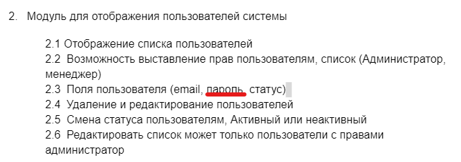

<p align="center">
    <h1 align="center">mini CRM</h1>
    <br>
</p>

**БАЗА ДАННЫХ**
- хост `127.0.0.1`
- порт `3305`
- пользователь `user`
- пароль `password`
- база `database`

**ЗАПУСК ПРОЕКТА**

1. запускаем докер из корня проекта `docker-compose up --build -d`
2. добавляем в файл `.hosts`
```
127.0.0.1	back.crm.local
127.0.0.1	front.crm.local
```
3. ставим vendor пакеты и инициируем проект
```
composer install
php ./init
```
4. применяем миграции
```
php yii migrate
php yii migrate --migrationPath=@yii/queue/db/migrations
php yii migrate --migrationPath=@yii/rbac/migrations
```
5. применяем команду инициализации (добавление ролей администратора и менеджера)

`php yii rbac/init`

**РАБОТА С ПРОЕКТОМ**

Для доступа к бэк и фронт части используем [back.crm.local](http://back.crm.local) или
[front.crm.local](http://front.crm.local) соответственно.

6. идём в часть бэка и регистрируем пользователя. Эта часть была взята из одного из моих проектов, поэтому менять там
ничего не стал - регистрация предполагает активацию аккаунта через ссылку с почты, поэтому:
- запскаем обработчик очереди `php yii queue/listen` или `php yii queue/run`
- идём в директорию `console/runtime/mail`, открываем последний `*.eml` файл и переходим по ссылке в письме
- ИЛИ достаём из таблицы БД `token` неиспользованный (`used_at IS NULL`) хэш типа `1` (активация) и идём по адресу
`http://back.crm.local/activate/<HASH>`
- ИЛИ меняем руками в таблице `user` поле `active` у нужной записи

7. выдаём права администратора пользователю

`php yii rbac/set-admin --email=<EMAIL>`

8. Авторизуемся
9. Профит!

Дальнейшая работа с проектом через UX должна быть интуитивна понятной, поэтому её не описываю.

Позволил себе немного свободы и некоторые вещи реализованы немного не по требованиям задания. Несмотря на это
общий функционал и смысл от этого не изменился.
- Не вижу смысла смешивать разные свойства сущности пользователя в одно поле, поэтому поле статуса у меня разделено на 3
(активен / заблокирован / удалён). Это значит, что пункт 2.5 задания реализован не как "Смена статуса пользователям,
Активный или неактивный", а заблокирован/разблокирован/удалён
- Так же не вижу смысла дублировать функционал в нескольких местах, поэтому смена статуса доступна только со страницы
просмотра деталей о пользователе. Удаление доступно как из списка, так и со страницы деталей. Редактирование ролей -
со страницы списка.
- Роль у пользователя может быть только одна (раз их всего 2 и они взаимоисключающие).
- Не понял, что такое "Наименование заявки", поэтому считаю, что это просто её краткий заголовок.
- Не считаю целесообразным давать возможность изменять время подачи и комментарий заявки, поэтому эти поля менять
нельзя

Так как это тестовое задание, в случае если оно не пройдёт "контроль качества", прошу конструктивную обратную связь.



Что простите? Пароли пользователей храняться в БД в захэшированном виде, восстановить который до исходного вида
невозможно. Зачем вообще показывать пароль пользователя?

Есть вопросы? ТГ [@ZCE_DEV](https://t.me/zce_dev)